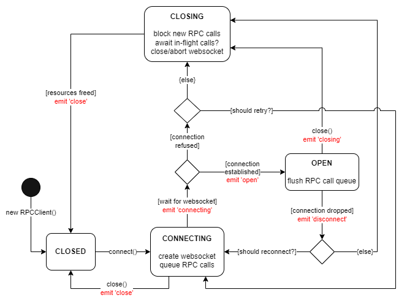

# OCPP-RPC

[](https://coveralls.io/github/mikuso/ocpp-rpc?branch=master)

[](https://github.com/mikuso/ocpp-rpc/issues)
[](https://github.com/mikuso/ocpp-rpc/blob/master/LICENSE.md)
[](https://github.com/mikuso/ocpp-rpc/stargazers)
[](https://github.com/mikuso/ocpp-rpc/network)


A client & server implementation of the WAMP-like RPC-over-websocket system defined in the [OCPP-J protocols](https://www.openchargealliance.org/protocols/) (e.g. [OCPP1.6J](https://www.openchargealliance.org/protocols/ocpp-16/) and [OCPP2.0.1J](https://www.openchargealliance.org/protocols/ocpp-201/)).

Requires Node.js >= 17.3.0

This module is built for Node.js and does not currently work in browsers.

## Who is this for?

* Anyone building an OCPP-based Charging Station or Charging Station Management System (CSMS) using Node.js.
* Anyone looking for a simple yet robust symmetrical RPC framework that runs over WebSockets.

## Features

* 🛂 **Authentication** - Optional authentication step for initiating session data and filtering incoming clients.
* 🔒 **[OCPP Security](#ocpp-security)** - Compatible with OCPP security profiles 1, 2 & 3.
* 💬 **Serve multiple subprotocols** - Simultaneously serve multiple different subprotocols from the same service endpoint.
* ✅ **[Strict Validation](#strict-validation)** - Optionally enforce subprotocol schemas to prevent invalid calls & responses.
* **Automatic reconnects** - Client supports automatic exponential-backoff reconnects.
* **Automatic keep-alive** - Regularly performs pings, and drops dangling TCP connections.
* **Graceful shutdowns** - Supports waiting for all in-flight messages to be responded to before closing sockets.
* **Clean closing of websockets** - Supports sending & receiving WebSocket close codes & reasons.
* **Embraces abort signals** - `AbortSignal`s can be passed to most async methods.
* **Optional HTTP server** - Bring your own HTTP server if you want to, or let `RPCServer` create one for you.

## Table of Contents

* [Installing](#installing)
* [Usage Examples](#usage-examples)
  * [Barebones OCPP1.6J server](#barebones-ocpp16j-server)
  * [Barebones OCPP1.6J client](#barebones-ocpp16j-client)
  * [Using with Express.js](#using-with-expressjs)
* [API Docs](#api-docs)
* [Strict Validation](#strict-validation)
* [OCPP Security](#ocpp-security)
  * [Security Profile 1](#security-profile-1)
  * [Security Profile 2](#security-profile-2)
  * [Security Profile 3](#security-profile-3)
* [RPCClient state lifecycle](#rpcclient-state-lifecycle)
* [Upgrading from 1.X -> 2.0](#upgrading-from-1x---20)
* [License](#license)

## Installing

```sh
npm install ocpp-rpc
```

## Usage Examples

### Barebones OCPP1.6J server

```js
const { RPCServer, createRPCError } = require('ocpp-rpc');

const server = new RPCServer({
    protocols: ['ocpp1.6'], // server accepts ocpp1.6 subprotocol
    strictMode: true,       // enable strict validation of requests & responses
});

server.auth((accept, reject, handshake) => {
    // accept the incoming client
    accept({
        // anything passed to accept() will be attached as a 'session' property of the client.
        sessionId: 'XYZ123'
    });
});

server.on('client', async (client) => {
    console.log(`${client.session.sessionId} connected!`); // `XYZ123 connected!`

    // create a specific handler for handling BootNotification requests
    client.handle('BootNotification', ({params}) => {
        console.log(`Server got BootNotification from ${client.identity}:`, params);

        // respond to accept the client
        return {
            status: "Accepted",
            interval: 300,
            currentTime: new Date().toISOString()
        };
    });
    
    // create a specific handler for handling Heartbeat requests
    client.handle('Heartbeat', ({params}) => {
        console.log(`Server got Heartbeat from ${client.identity}:`, params);

        // respond with the server's current time.
        return {
            currentTime: new Date().toISOString()
        };
    });
    
    // create a specific handler for handling StatusNotification requests
    client.handle('StatusNotification', ({params}) => {
        console.log(`Server got StatusNotification from ${client.identity}:`, params);
        return {};
    });

    // create a wildcard handler to handle any RPC method
    client.handle(({method, params}) => {
        // This handler will be called if the incoming method cannot be handled elsewhere.
        console.log(`Server got ${method} from ${client.identity}:`, params);

        // throw an RPC error to inform the server that we don't understand the request.
        throw createRPCError("NotImplemented");
    });
});

await server.listen(3000);
```

### Barebones OCPP1.6J client

```js
const { RPCClient } = require('ocpp-rpc');

const cli = new RPCClient({
    endpoint: 'ws://localhost:3000', // the OCPP endpoint URL
    identity: 'EXAMPLE',             // the OCPP identity
    protocols: ['ocpp1.6'],          // client understands ocpp1.6 subprotocol
    strictMode: true,                // enable strict validation of requests & responses
});

// connect to the OCPP server
await cli.connect();

// send a BootNotification request and await the response
const bootResponse = await cli.call('BootNotification', {
    chargePointVendor: "ocpp-rpc",
    chargePointModel: "ocpp-rpc",
});

// check that the server accepted the client
if (bootResponse.status === 'Accepted') {

    // send a Heartbeat request and await the response
    const heartbeatResponse = await cli.call('Heartbeat', {});
    // read the current server time from the response
    console.log('Server time is:', heartbeatResponse.currentTime);

    // send a StatusNotification request for the controller
    await cli.call('StatusNotification', {
        connectorId: 0,
        errorCode: "NoError",
        status: "Available",
    });
}
```

### Using with [Express.js](https://expressjs.com/)

```js
const {RPCServer, RPCClient} = require('ocpp-rpc');
const express = require('express');

const app = express();
const httpServer = app.listen(3000, 'localhost');

const rpcServer = new RPCServer();
httpServer.on('upgrade', rpcServer.handleUpgrade);

rpcServer.on('client', client => {
    // RPC client connected
    client.call('Say', `Hello, ${client.identity}!`);
});

// create a simple client to connect to the server
const cli = new RPCClient({
    endpoint: 'ws://localhost:3000',
    identity: 'XYZ123'
});

cli.handle('Say', ({params}) => {
    console.log('Server said:', params);
});

await cli.connect();
```

## API Docs

* [Class: RPCServer](#class-rpcserver)
  * [new RPCServer(options)](#new-rpcserveroptions)
  * [Event: 'client'](#event-client)
  * [Event: 'error'](#event-error)
  * [Event: 'close'](#event-close)
  * [Event: 'closing'](#event-closing)
  * [Event: 'upgradeAborted'](#event-upgradeaborted)
  * [server.auth(callback)](#serverauthcallback)
  * [server.handleUpgrade(request)](#serverhandleupgraderequest-socket-head)
  * [server.reconfigure(options)](#serverreconfigureoptions)
  * [server.listen(port[, host[, options]])](#serverlistenport-host-options)
  * [server.close([options])](#servercloseoptions)

* [Class: RPCClient](#class-rpcclient)
  * [new RPCClient(options)](#new-rpcclientoptions)
  * [Event: 'badMessage'](#event-badmessage)
  * [Event: 'strictValidationFailure'](#event-strictvalidationfailure)
  * [Event: 'message'](#event-message)
  * [Event: 'call'](#event-call)
  * [Event: 'callResult'](#event-callresult)
  * [Event: 'callError'](#event-callerror)
  * [Event: 'close'](#event-close-1)
  * [Event: 'closing'](#event-closing-1)
  * [Event: 'connecting'](#event-connecting)
  * [Event: 'disconnect'](#event-disconnect)
  * [Event: 'open'](#event-open)
  * [Event: 'ping'](#event-ping)
  * [Event: 'protocol'](#event-protocol)
  * [Event: 'response'](#event-response)
  * [Event: 'socketError'](#event-socketerror)
  * [client.identity](#clientidentity)
  * [client.state](#clientstate)
  * [client.protocol](#clientprotocol)
  * [client.reconfigure(options)](#clientreconfigureoptions)
  * [client.removeHandler([method])](#clientremovehandlermethod)
  * [client.removeAllHandlers()](#clientremoveallhandlers)
  * [client.connect()](#clientconnect)
  * [client.close([options])](#clientcloseoptions)
  * [client.handle([method,] handler)](#clienthandlemethod-handler)
  * [client.call(method[, params[, options]])](#clientcallmethod-params-options)
  * [client.sendRaw(message)](#clientsendrawmessage)

* [Class: RPCServerClient](#class-rpcserverclient--rpcclient)
  * [client.handshake](#clienthandshake)
  * [client.session](#clientsession)

* [Class: RPCError](#class-rpcerror--error)
  * [err.rpcErrorCode](#errrpcerrorcode)
  * [err.details](#errdetails)

* [createValidator(subprotocol, schema)](#createvalidatorsubprotocol-schema)
* [createRPCError(type[, message[, details]])](#createrpcerrortype-message-details)

### Class: RPCServer

#### new RPCServer(options)

- `options` {Object}
  - `protocols` {Array&lt;String&gt;} - Array of subprotocols supported by this server. Can be overridden in an [auth](#serverauthcallback) callback. Defaults to `[]`.
  - `callTimeoutMs` {Number} - Milliseconds to wait before unanswered outbound calls are rejected automatically. Defaults to `30000`.
  - `pingIntervalMs` {Number} - Milliseconds between WebSocket pings to connected clients. Used for keep-alive timeouts. Defaults to `30000`.
  - `deferPingsOnActivity` {Boolean} - Should connected clients skip sending keep-alive pings if activity received? Defaults to `false`.
  - `respondWithDetailedErrors` {Boolean} - Specifies whether to send detailed errors (including stack trace) to remote party upon an error being thrown by a handler. Defaults to `false`.
  - `callConcurrency` {Number} - The number of concurrent in-flight outbound calls permitted at any one time. Additional calls are queued. (There is no limit on inbound calls.) Defaults to `1`.
  - `strictMode` {Boolean} - Enable strict validation of calls & responses. Defaults to `false`. (See [Strict Validation](#strict-validation) to understand how this works.)
  - `strictModeValidators` {Array&lt;Validator&gt;} - Optional additional validators to be used in conjunction with `strictMode`. (See [Strict Validation](#adding-additional-validation-schemas) to understand how this works.)
  - `maxBadMessages` {Number} - The maximum number of [non-conforming RPC messages](#event-rpcerror) which can be tolerated by the server before the client is automatically closed. Defaults to `Infinity`.
  - `wssOptions` {Object} - Additional [WebSocketServer options](https://github.com/websockets/ws/blob/master/doc/ws.md#new-websocketserveroptions-callback).

#### Event: 'client'

* `client` {RPCServerClient}

Emitted when a client has connected and been accepted. By default, a client will be automatically accepted if it connects with a matching subprotocol offered by the server (as per the `protocols` option in the server constructor). This behaviour can be overriden by [setting an auth handler](#serverauthcallback).

#### Event: 'error'

* `error` {Error}

Emitted when the underlying WebSocketServer emits an error.

#### Event: 'close'

Emitted when the server has fully closed and all clients have been disconnected.

#### Event: 'closing'

Emitted when the server has begun closing. Beyond this point, no more clients will be accepted and the `'client'` event will no longer fire.

#### Event: 'upgradeAborted'

* `event` {Object}
  * `error` {Error} - The cause of the abort.
  * `socket` {net.Socket} - Network socket between the server and client
  * `request` {http.IncomingMessage} - The full HTTP request received by the underlying webserver.
  * `identity` {String} - The identity portion of the connection URL, decoded.

Emitted when a websocket upgrade has been aborted. This could be caused by an authentication rejection, socket error or websocket handshake error.

#### server.auth(callback)

* `callback` {Function}

Sets an authentication callback to be called before each client is accepted by the server. Setting an authentication callback is optional. By default, clients are accepted if they simply support a matching subprotocol.

The callback function is called with the following three arguments:

* `accept` {Function} - A function with the signature `accept([session[, protocol]])`. Call this function to accept the client, causing the server to emit a `'client'` event.
  * `session` {*} - Optional data to save as the client's 'session'. This data can later be retrieved from the [`session`](#clientsession) property of the client.
  * `protocol` {String} - Optionally explicitly set the subprotocol to use for this connection. If not set, the subprotocol will be decided automatically as the first mutual subprotocol (in order of the [RPCServer constructor](#new-rpcserveroptions)'s `protocols` value). If a non mutually-agreeable subprotocol value is set, the client will be rejected instead.

* `reject` {Function} - A function with the signature `reject([code[, message]])`
  * `code` {Number} - The HTTP error code to reject the upgrade. Defaults to `400`.
  * `message` {String} - An optional message to send as the response body. Defaults to `''`.

* `handshake` {Object} - A handshake object
  * `protocols` {Set} - A set of subprotocols purportedly supported by the client.
  * `identity` {String} - The identity portion of the connection URL, decoded.
  * `password` {Buffer} - If HTTP Basic auth was used in the connection, and the username correctly matches the identity, this field will contain the password (otherwise `undefined`). Typically this password would be a string, but the OCPP specs allow for this to be binary, so it is provided as a `Buffer` for you to interpret as you wish. Read [Security Profile 1](#security-profile-1) for more details of how this works.
  * `endpoint` {String} - The endpoint path portion of the connection URL. This is the part of the path before the identity.
  * `query` {URLSearchParams} - The query string parsed as [URLSearchParams](https://developer.mozilla.org/en-US/docs/Web/API/URLSearchParams).
  * `remoteAddress` {String} - The remote IP address of the socket.
  * `headers` {Object} - The HTTP headers sent in the upgrade request.
  * `request` {http.IncomingMessage} - The full HTTP request received by the underlying webserver.

* `signal` {AbortSignal} - An `AbortSignal` used to indicate whether the websocket upgrade has been aborted during the authentication process.  The `signal.reason` is also available as the `error` property of the ['upgradeAborted'](#event-upgradeaborted) event.

Example:

```js
const rpcServer = new RPCServer();
rpcServer.auth((accept, reject, handshake, signal) => {
    if (handshake.identity === 'TEST') {
        accept();
    } else {
        reject(401, "I don't recognise you");
    }
});
```

#### server.handleUpgrade(request, socket, head)

* `request` {http.IncomingMessage}
* `socket` {net.Socket} - Network socket between the server and client
* `head` {Buffer} - The first packet of the upgraded stream (may be empty)

Converts an HTTP upgrade request into a WebSocket client to be handled by this RPCServer. This method is bound to the server instance, so it is suitable to pass directly as an `http.Server`'s `'upgrade'` event handler.

This is typically only needed if you are creating your own HTTP server. HTTP servers created by [`listen()`](#serverlistenport-host-options) have their `'upgrade'` event attached to this method automatically.

Example:

```js
const rpcServer = new RPCServer();
const httpServer = http.createServer();
httpServer.on('upgrade', rpcServer.handleUpgrade);
```

#### server.reconfigure(options)

* `options` {Object}

Use this method to change any of the `options` that can be passed to the `RPCServer`'s [constructor](#new-rpcserveroptions).

#### server.listen([port[, host[, options]]])

* `port` {Number} - The port number to listen on. If not set, the operating system will assign an unused port.
* `host` {String} - The host address to bind to. If not set, connections will be accepted on all interfaces.
* `options` {Object}
  * `signal` {AbortSignal} - An `AbortSignal` used to abort the `listen()` call of the underlying `net.Server`.

Creates a simple HTTP server which only accepts websocket upgrades and returns a 404 response to any other request.

Returns a Promise which resolves to an instance of `http.Server` or rejects with an `Error` on failure.

#### server.close([options])

* `options` {Object}
  * `code` {Number} - The [WebSocket close code](https://developer.mozilla.org/en-US/docs/Web/API/CloseEvent/code) to pass to all connected clients. Defaults to `1000`.
  * `reason` {String} - The reason for closure to pass to all connected clients. Defaults to `''`.
  * `awaitPending` {Boolean} - If `true`, each connected client won't be fully closed until any outstanding in-flight (inbound & outbound) calls are responded to. Additional calls will be rejected in the meantime. Defaults to `false`.
  * `force` {Boolean} - If `true`, terminates all client WebSocket connections instantly and uncleanly. Defaults to `false`.

This blocks new clients from connecting, calls [`client.close()`](#clientcloseoptions) on all connected clients, and then finally closes any listening HTTP servers which were created using [`server.listen()`](#serverlistenport-host-options).

Returns a `Promise` which resolves when the server has completed closing.

### Class: RPCClient

#### new RPCClient(options)

- `options` {Object}
  - `endpoint` {String} - The RPC server's endpoint (a websocket URL). **Required**.
  - `identity` {String} - The RPC client's identity. Will be automatically encoded. **Required**.
  - `protocols` {Array&lt;String&gt;} - Array of subprotocols supported by this client. Defaults to `[]`.
  - `password` {String|Buffer} - Optional password to use in [HTTP Basic auth](#security-profile-1). This can be a Buffer to allow for binary auth keys as recommended in the OCPP security whitepaper. If provided as a string, it will be encoded as UTF-8. (The corresponding username will always be the identity).
  - `headers` {Object} - Additional HTTP headers to send along with the websocket upgrade request. Defaults to `{}`.
  - `query` {Object|String} - An optional query string or object to append as the query string of the connection URL. Defaults to `''`.
  - `callTimeoutMs` {Number} - Milliseconds to wait before unanswered outbound calls are rejected automatically. Defaults to `60000`.
  - `pingIntervalMs` {Number} - Milliseconds between WebSocket pings. Used for keep-alive timeouts. Defaults to `30000`.
  - `deferPingsOnActivity` {Boolean} - Should the client skip sending keep-alive pings if activity received? Defaults to `false`.
  - `strictMode` {Boolean} - Enable strict validation of calls & responses. Defaults to `false`. (See [Strict Validation](#strict-validation) to understand how this works.)
  - `strictModeValidators` {Array&lt;Validator&gt;} - Optional additional validators to be used in conjunction with `strictMode`. (See [Strict Validation](#adding-additional-validation-schemas) to understand how this works.)
  - `respondWithDetailedErrors` {Boolean} - Specifies whether to send detailed errors (including stack trace) to remote party upon an error being thrown by a handler. Defaults to `false`.
  - `callConcurrency` {Number} - The number of concurrent in-flight outbound calls permitted at any one time. Additional calls are queued. There is no concurrency limit imposed on inbound calls. Defaults to `1`.
  - `reconnect` {Boolean} - If `true`, the client will attempt to reconnect after losing connection to the RPCServer. Only works after making one initial successful connection. Defaults to `true`.
  - `maxReconnects` {Number} - If `reconnect` is `true`, specifies the number of times to try reconnecting before failing and emitting a `close` event. Defaults to `Infinity`
  - `backoff` {Object} - If `reconnect` is `true`, specifies the options for an [ExponentialStrategy](https://github.com/MathieuTurcotte/node-backoff#class-exponentialstrategy) backoff strategy, used for reconnects.
  - `maxBadMessages` {Number} - The maximum number of [non-conforming RPC messages](#event-rpcerror) which can be tolerated by the client before the client is automatically closed. Defaults to `Infinity`.
  - `wsOpts` {Object} - Additional [WebSocket options](https://github.com/websockets/ws/blob/master/doc/ws.md#new-websocketaddress-protocols-options).

#### Event: 'badMessage'

* `event` {Object}
  * `buffer` {Buffer} - The raw discarded "bad" message payload.
  * `error` {Error} - An error describing what went wrong when handling the payload.
  * `response` {Array|null} - A copy of the response sent in reply to the bad message (if applicable).

This event is emitted when a "bad message" is received. A "bad message" is simply one which does not structurally conform to the RPC protocol or violates some other principle of the framework (such as a response to a call which was not made). If appropriate, the client will respond with a `"RpcFrameworkError"` or similar error code (depending upon the violation) as required by the spec.

(To be clear, this event will **not** simply be emitted upon receipt of an error response or invalid call. The message itself must actually be non-conforming to the spec to be considered "bad".)

If too many bad messages are received in succession, the client will be closed with a close code of `1002`. The number of bad messages tolerated before automatic closure is determined by the `maxBadMessages` option. After receiving a valid (non-bad) message, the "bad message" counter will be reset. 

#### Event: 'strictValidationFailure'

* `event` {Object}
  * `error` {Error} - The validation error that triggered the `strictValidationFailure` event.
  * `messageId` {String} - The RPC message ID
  * `method` {String} - The RPC method being invoked.
  * `params` {Object} - The RPC parameters.
  * `result` {Object} - If this error relates to a **CALLRESULT** validation failure, then this contains the invalid result, otherwise `null`.
  * `outbound` {Boolean} - This will be `true` if the invalid message originated locally.
  * `isCall` {Boolean} - This will be `true` if the invalid message is a **CALL** type. `false` indicates a **CALLRESULT** type.

This event is emitted in [strict mode](#strict-validation) when an inbound call or outbound response does not satisfy the subprotocol schema validator. See [Effects of `strictMode`](#effects-of-strictmode) to understand what happens in response to the invalid message.

#### Event: 'call'

* `call` {Object}
  * `messageId` {String} - The RPC message ID
  * `outbound` {Boolean} - This will be `true` if the call originated locally.
  * `payload` {Array} - The RPC call payload array.

Emitted immediately before a call request is sent, or in the case of an inbound call, immediately before the call is processed. Useful for logging or debugging.

If you want to handle (and respond) to the call, you should register a handler using [client.handle()](#clienthandlemethod-handler) instead.

#### Event: 'callResult'

* `event` {Object}
  * `messageId` {String} - The RPC message ID
  * `outbound` {Boolean} - This will be `true` if the call originated locally.
  * `method` {String} - The RPC method.
  * `params` {Object} - The RPC params.
  * `result` {Object} - The result of the call.

Emitted immediately after a call result is successfully sent or received. Useful for logging or debugging.

#### Event: 'callError'

* `event` {Object}
  * `messageId` {String} - The RPC message ID
  * `outbound` {Boolean} - This will be `true` if the call originated locally.
  * `method` {String} - The RPC method.
  * `params` {Object} - The RPC params.
  * `error` {RPCError} - The error from the call.

Emitted immediately after a call error is sent or received. Useful for logging or debugging.

Will not be emitted if NOREPLY is sent as a response, or if a call times out.

#### Event: 'close'

* `event` {Object}
  * `code` {Number} - The close code received.
  * `reason` {String} - The reason for the connection closing.

Emitted after `client.close()` completes.

#### Event: 'closing'

Emitted when the client is closing and does not plan to reconnect.

#### Event: 'connecting'

Emitted when the client is trying to establish a new WebSocket connection. If sucessful, the this should be followed by an `'open'` event.

#### Event: 'disconnect'

* `event` {Object}
  * `code` {Number} - The close code received.
  * `reason` {String} - The reason for the connection closing.

Emitted when the underlying WebSocket has disconnected. If the client is configured to reconnect, this should be followed by a `'connecting'` event, otherwise a `'closing'` event.

#### Event: 'message'

* `event` {Object}
  * `message` {Buffer|String} - The message payload.
  * `outbound` {Boolean} - This will be `true` if the message originated locally.

Emitted whenever a message is sent or received over client's WebSocket. Useful for logging or debugging.

If you want to handle (and respond) to a call, you should register a handler using [client.handle()](#clienthandlemethod-handler) instead.

#### Event: 'open'

* `result` {Object}
  * `response` {http.ServerResponse} - The response to the client's upgrade request.

Emitted when the client is connected to the server and ready to send & receive calls.

#### Event: 'ping'

* `event` {Object}
  * `rtt` {Number} - The round trip time (in milliseconds) between when the ping was sent and the pong was received.

Emitted when the client has received a response to a ping.

#### Event: 'protocol'

* `protocol` {String} - The mutually agreed websocket subprotocol.

Emitted when the client protocol has been set. Once set, this cannot change. This event only occurs once per [`connect()`](#clientconnect).

#### Event: 'response'

* `response` {Object}
  * `outbound` {Boolean} - This will be `true` if the response originated locally.
  * `payload` {Array} - The RPC response payload array.

Emitted immediately before a response request is sent, or in the case of an inbound response, immediately before the response is processed. Useful for logging or debugging.

#### Event: 'socketError'

* `error` {Error}

Emitted when the underlying WebSocket instance fires an `'error'` event.

#### client.identity

* {String}

The decoded client identity.

#### client.state

* {Number}

The client's state. See [state lifecycle](#rpcclient-state-lifecycle)

| Enum       | Value |
| ---------- | ----- |
| CONNECTING | 0     |
| OPEN       | 1     |
| CLOSING    | 2     |
| CLOSED     | 3     |

#### client.protocol

* {String}

The agreed subprotocol. Once connected for the first time, this subprotocol becomes fixed and will be expected upon automatic reconnects (even if the server changes the available subprotocol options).

#### client.reconfigure(options)

* `options` {Object}

Use this method to change any of the `options` that can be passed to the `RPCClient`'s [constructor](#new-rpcclientoptions).

When changing `identity`, the `RPCClient` must be explicitly `close()`d and then `connect()`ed for the change to take effect.

#### client.removeHandler([method])

* `method` {String}

Unregisters a call handler. If no method name is provided, it will unregister the wildcard handler instead.

#### client.removeAllHandlers()

Unregisters all previously-registered call handlers (including wildcard handler if set).

#### client.connect()

The client will attempt to connect to the `RPCServer` specified in `options.url`.

Returns a `Promise` which will either resolve to a `result` object upon successfully connecting, or reject if the connection fails.

* `result` {Object}
  * `response` {http.ServerResponse} - The response to the client's upgrade request.

#### client.sendRaw(message)

* `message` {Array|Number|Object|String|ArrayBuffer|Buffer|DataView|TypedArray} - A raw message to send across the WebSocket.

Send arbitrary data across the websocket. Not intended for general use.

#### client.close([options])
* `options` {Object}
  * `code` {Number} - The [WebSocket close code](https://developer.mozilla.org/en-US/docs/Web/API/CloseEvent/code). Defaults to `1000`.
  * `reason` {String} - The reason for closure. Defaults to `''`.
  * `awaitPending` {Boolean} - If `true`, the connection won't be fully closed until any outstanding in-flight (inbound & outbound) calls are responded to. Additional calls will be rejected in the meantime. Defaults to `false`.
  * `force` {Boolean} - If `true`, terminates the WebSocket connection instantly and uncleanly. Defaults to `false`.

Close the underlying connection. Unless `awaitPending` is true, all in-flight outbound calls will be instantly rejected and any inbound calls in process will have their `signal` aborted. Unless `force` is true, `close()` will wait until all calls are settled before returning the final `code` and `reason` for closure.

Returns a `Promise` which resolves to an Object with properties `code` and `reason`.

In some circumstances, the final `code` and `reason` returned may be different from those which were requested. For instance, if `close()` is called twice, the first `code` provided is canonical. Also, if `close()` is called while in the CONNECTING state during the first connect, the `code` will always be `1001`, with the `reason` of `'Connection aborted'`.

#### client.handle([method,] handler)

* `method` {String} - The name of the method to be handled. If not provided, acts as a "wildcard" handler which will handle any call that doesn't have a more specific handler already registered.
* `handler` {Function} - The function to be invoked when attempting to handle a call.

Registers a call handler. Only one "wildcard" handler can be registered at once. Likewise, attempting to register a handler for a method which is already being handled will override the former handler.

When the `handler` function is invoked, it will be passed an object with the following properties:
* `method` {String} - The name of the method being invoked (useful for wildcard handlers).
* `params` {*} - The parameters of the call.
* `signal` {AbortSignal} - A signal which will abort if the underlying connection is dropped (therefore, the response will never be received by the caller). You may choose whether to ignore the signal or not, but it could save you some time if you use it to abort the call early.
* `messageId` {String} - The OCPP Message ID used in the call.
* `reply` {Function} - A callback function with which to pass a response to the call. Accepts a response value, an `Error`, or a `Promise`.

Responses to handled calls are sent according to these rules:
* If a value (or a `Promise` which resolves to a value) is passed to `reply()`, a **CALLRESULT** will be sent with this value as the result.
* If an `Error` (or a `Promise` which rejects with an `Error`) is passed to `reply()`, a **CALLERROR** will be sent instead. (The `Error` may be coerced into an `RPCError`. You can use [createRPCError()](#createrpcerrortype-message-details) to reply with a specific RPC error code.)
* If the `NOREPLY` symbol is passed to `reply()`, then no response will be sent. It will then be your responsibility to send the response by some other means (such as with [`sendRaw()`](#clientsendrawmessage)).
* If the `handler` returns or throws before `reply()` is called, then the `reply()` callback will be called implicitly with the returned value (or thrown `Error`).
* Calling `reply()` more than once, or returning/throwing after calling `reply()` is considered a no-op, will not result in any additional responses being sent, and has no effect.

##### Example of handling an OCPP1.6 Heartbeat

```js
client.handle('Heartbeat', ({reply}) => {
    reply({ currentTime: new Date().toISOString() });
});

// or...
client.handle('Heartbeat', () => {
    return { currentTime: new Date().toISOString() };
});
```

##### Example of using NOREPLY

```js
const {NOREPLY} = require('ocpp-rpc');

client.handle('WontReply', ({reply}) => {
    reply(NOREPLY);
});

// or...
client.handle('WontReply', () => {
    return NOREPLY;
});
```

#### client.call(method[, params[, options]])

* `method` {String} - The name of the method to call.
* `params` {*} - Parameters to send to the call handler.
* `options` {Object}
  * `callTimeoutMs` {Number} - Milliseconds before unanswered call is rejected. Defaults to the same value as the option passed to the client/server constructor.
  * `signal` {AbortSignal} - `AbortSignal` to abort the call.
  * `noReply` {Boolean} - Send call without expecting a response, resolving immediately with `undefined`. If a response is received, a `badMessage` event will be emitted instead. Defaults to `false`.

Calls a remote method. Returns a `Promise` which either:
* resolves to the value returned by the remote handler.
* rejects with an error.

If the underlying connection is interrupted while waiting for a response, the `Promise` will reject with an `Error`.

It's tempting to set `callTimeoutMs` to `Infinity` but this could be a mistake; If the remote handler never returns a response, the RPC communications will be blocked as soon as `callConcurrency` is exhausted (which is `1` by default). (While this is still an unlikely outcome when using this module for both client *and* server components - interoperability with real world systems can sometimes be unpredictable.)

### Class: RPCServerClient : RPCClient

The RPCServerClient is a subclass of RPCClient. This represents an RPCClient from the server's perspective. It has all the same properties and methods as RPCClient but with a couple of additional properties...

#### client.handshake

* {Object}
  * `protocols` {Set} - A set of subprotocols purportedly supported by the client.
  * `identity` {String} - The identity portion of the connection URL, decoded.
  * `password` {Buffer} - If HTTP Basic auth was used in the connection, and the username correctly matches the identity, this field will contain the password (otherwise `undefined`). Typically this password would be a string, but the OCPP specs allow for this to be binary, so it is provided as a `Buffer` for you to interpret as you wish. Read [Security Profile 1](#security-profile-1) for more details of how this works.
  * `endpoint` {String} - The endpoint path portion of the connection URL. This is the part of the path before the identity.
  * `query` {URLSearchParams} - The query string parsed as [URLSearchParams](https://developer.mozilla.org/en-US/docs/Web/API/URLSearchParams).
  * `remoteAddress` {String} - The remote IP address of the socket.
  * `headers` {Object} - The HTTP headers sent in the upgrade request.
  * `request` {http.IncomingMessage} - The full HTTP request received by the underlying webserver.

This property holds information collected during the WebSocket connection handshake.

#### client.session

* {*}

This property can be anything. This is the value passed to `accept()` during the authentication callback.

### createValidator(subprotocol, schema)

* `subprotocol` {String} - The name of the subprotocol that this schema can validate.
* `schema` {Array} - An array of json schemas.

Returns a `Validator` object which can be used for [strict mode](#strict-validation).

### Class: RPCError : Error

An error representing a violation of the RPC protocol.

Throwing an RPCError from within a registered handler will pass the RPCError back to the caller.

To create an RPCError, it is recommended to use the utility method [`createRPCError()`](#createrpcerrortype-message-details).

#### err.rpcErrorCode

* {String}

The OCPP-J RPC error code.

#### err.details

* {Object}

An object containing additional error details.

### createRPCError(type[, message[, details]])
* `type` {String} - One of the supported error types (see below).
* `message` {String} - The error's message.
* `details` {Object} - The details object to pass along with the error. Defaults to `{}`.

This is a utility function to create a special type of RPC Error to be thrown from a call handler to return a non-generic error response.

Returns an [`RPCError`](#class-rpcerror--error) which corresponds to the specified type:

| Type                          | Description                                                                                                                |
| ----------------------------- | -------------------------------------------------------------------------------------------------------------------------- |
| GenericError                  | A generic error when no more specific error is appropriate.                                                                |
| NotImplemented                | Requested method is not known.                                                                                             |
| NotSupported                  | Requested method is recognised but not supported.                                                                          |
| InternalError                 | An internal error occurred and the receiver was not able to process the requested method successfully.                     |
| ProtocolError                 | Payload for method is incomplete.                                                                                          |
| SecurityError                 | During the processing of method a security issue occurred preventing receiver from completing the method successfully.     |
| FormatViolation               | Payload for the method is syntactically incorrect or not conform the PDU structure for the method.                         |
| FormationViolation            | [Deprecated] Same as FormatViolation. Retained for backwards compatibility with OCPP versions 1.6 and below.               |
| PropertyConstraintViolation   | Payload is syntactically correct but at least one field contains an invalid value.                                         |
| OccurrenceConstraintViolation | Payload for the method is syntactically correct but at least one of the fields violates occurence constraints.             |
| OccurenceConstraintViolation  | [Deprecated] Same as OccurrenceConstraintViolation. Retained for backwards compatibility with OCPP versions 1.6 and below. |
| TypeConstraintViolation       | Payload for the method is syntactically correct but at least one of the fields violates data type constraints.             |
| MessageTypeNotSupported       | A message with a Message Type Number received is not supported by this implementation.                                     |
| RpcFrameworkError             | Content of the call is not a valid RPC Request, for example: MessageId could not be read.                                  |

## Strict Validation

RPC clients can operate in "strict mode", validating calls & responses according to subprotocol schemas. The goal of strict mode is to eliminate the possibility of invalid data structures being sent through RPC.

To enable strict mode, pass `strictMode: true` in the options to the [`RPCServer`](#new-rpcserveroptions) or [`RPCClient`](#new-rpcclientoptions) constructor. Alternately, you can limit strict mode to specific protocols by passing an array for `strictMode` instead. The schema ultimately used for validation is determined by whichever subprotocol is agreed between client and server.

Examples:

```js
// enable strict mode for all subprotocols
const server = new RPCServer({
    protocols: ['ocpp1.6', 'ocpp2.0.1'],
    strictMode: true,
});
```

```js
// only enable strict mode for ocpp1.6
const server = new RPCServer({
    protocols: ['ocpp1.6', 'proprietary0.1'],
    strictMode: ['ocpp1.6'],
});
```

### Effects of `strictMode`

As a caller, `strictMode` has the following effects:
* If your method or params fail validation, your call will reject immediately with an [`RPCError`](#class-rpcerror--error). The call will not be sent.
* If a response to your call fails validation, the call will reject with an [`RPCError`](#class-rpcerror--error) and you will not receive the actual response that was sent.

As a callee, `strictMode` has the following effects:
* If an inbound call's params fail validation, the call will not be passed to a handler. Instead, an error response will be automatically issued to the caller with an appropriate RPC error.
* If your response to a call fails validation, then your response will be discarded and an `"InternalError"` RPC error will be sent instead.

In all cases, a [`'strictValidationFailure'`](#event-strictvalidationfailure) event will be emitted, detailing the circumstances of the failure.

**Important:** If you are using `strictMode`, you are strongly encouraged to listen for [`'strictValidationFailure'`](#event-strictvalidationfailure) events, otherwise you may not know if your responses or inbound calls are being dropped for failing validation.

### Supported validation schemas

This module natively supports the following validation schemas:

| Subprotocol |
| ----------- |
| ocpp1.6     |
| ocpp2.0.1   |

### Adding additional validation schemas

If you want to use `strictMode` with a subprotocol which is not included in the list above, you will need to add the appropriate schemas yourself. To do this, you must create a `Validator` for each subprotocol and pass them to the RPC constructor using the `strictModeValidators` option.  (It is also possible to override the built-in validators this way.)

To create a Validator, you should pass the name of the subprotocol and a well-formed json schema to [`createValidator()`](#createvalidatorsubprotocol-schema). An example of a well-formed schema can be found at [`./lib/schemas/ocpp1_6.json`](./lib/schemas/ocpp1_6.json) or [`./lib/schemas/ocpp2_0_1.json`](./lib/schemas/ocpp2_0_1.json) or in the example below.

Example:

```js
// define a validator for subprotocol 'echo1.0'
const echoValidator = createValidator('echo1.0', [
    {
        $schema: "http://json-schema.org/draft-07/schema",
        $id: "urn:Echo.req",
        type: "object",
        properties: {
            val: { type: "string" }
        },
        additionalProperties: false,
        required: ["val"]
    },
    {
        $schema: "http://json-schema.org/draft-07/schema",
        $id: "urn:Echo.conf",
        type: "object",
        properties: {
            val: { type: "string" }
        },
        additionalProperties: false,
        required: ["val"]
    }
]);

const server = new RPCServer({
    protocols: ['echo1.0'],
    strictModeValidators: [echoValidator],
    strictMode: true,
});

/*
client.call('Echo', {val: 'foo'}); // returns {val: foo}
client.call('Echo', ['bar']); // throws RPCError
*/
```

Once created, the `Validator` is immutable and can be reused as many times as is required.

## OCPP Security

It is possible to achieve all levels of OCPP security using this module. Keep in mind though that many aspects of OCPP security (such as key management, certificate generation, etc...) are beyond the scope of this module and it will be up to you to implement them yourself.

### Security Profile 1

This security profile requires HTTP Basic Authentication. Clients are able to provide a HTTP basic auth password via the `password` option of the [`RPCClient` constructor](#new-rpcclientoptions). Servers are able to validate the password within the callback passed to [`auth()`](#serverauthcallback).

#### Client & Server Example

```js
const cli = new RPCClient({
    identity: "AzureDiamond",
    password: "hunter2",
});

const server = new RPCServer();
server.auth((accept, reject, handshake) => {
    if (handshake.identity === "AzureDiamond" && handshake.password.toString('utf8') === "hunter2") {
        accept();
    } else {
        reject(401);
    }
});

await server.listen(80);
await cli.connect();
```

#### A note on identities containing colons

This module supports HTTP Basic auth slightly differently than how it is specified in [RFC7617](https://datatracker.ietf.org/doc/html/rfc7617). In that spec, it is made clear that usernames cannot contain colons (:) as a colon is used to delineate where a username ends and a password begins.

In the context of OCPP, the basic-auth username must always be equal to the client's identity. However, since OCPP does not forbid colons in identities, this can possibly lead to a conflict and unexpected behaviours.

In practice, it's not uncommon to see violations of RFC7617 in the wild. All major browsers allow basic-auth usernames to contain colons, despite the fact that this won't make any sense to the server; RFC7617 acknowledges this fact in its text. The established solution to this problem seems to be to simply ignore it.

However, in OCPP, since we have the luxury of knowing that the username must always be equal to the client's identity, it is no longer necessary to rely upon a colon to delineate the username from the password. This module makes use of this guarantee to enable identities and passwords to contain as many or as few colons as you wish.

Additionally, the OCPP security whitepaper recommends passwords consist purely of random bytes (for maximum entropy), although this violates the Basic Auth RFC which requires all passwords to be TEXT (US-ASCII compatible with no control characters). For this reason, this library will not make any presumptions about the character encoding (or otherwise) of the password provided, and present the password as a `Buffer`.

```js
const { RPCClient, RPCServer } = require('ocpp-rpc');

const cli = new RPCClient({
    identity: "this:is:ok",
    password: "as:is:this",
});

const server = new RPCServer();
server.auth((accept, reject, handshake) => {
    console.log(handshake.identity);                  // "this:is:ok"
    console.log(handshake.password.toString('utf8')); // "as:is:this"
    accept();
});

await server.listen(80);
await cli.connect();
```

If you prefer to use the more conventional (broken) way of parsing the authorization header using something like the [basic-auth](https://www.npmjs.com/package/basic-auth) module, you can do that too.


```js
const auth = require('basic-auth');

const cli = new RPCClient({
    identity: "this:is:broken",
    password: "as:is:this",
});

const server = new RPCServer();
server.auth((accept, reject, handshake) => {
    const cred = auth.parse(handshake.headers.authorization);

    console.log(cred.name);                  // "this"
    console.log(cred.pass.toString('utf8')); // "is:broken:as:is:this"
    accept();
});

await server.listen(80);
await cli.connect();
```

### Security Profile 2

This security profile requires that the central system offers a TLS-secured endpoint in addition to HTTP Basic Authentication [(as per profile 1)](#security-profile-1).

When implementing TLS, keep in mind that OCPP specifies a minimum TLS version and minimum set of cipher suites for maximal compatibility and security. Node.js natively supports this minimum set of requirements, but there's a couple of things you should keep in mind:

* The minimum TLS version should be explicitly enforced to prevent a client from using a weak TLS version. The OCPP spec currently sets the minimum TLS version at v1.2 (with v1.1 and v1.0 being permitted for OCPP1.6 only under exceptional circumstances).
* The central server role must support both RSA & ECDSA algorithms, so will need a corresponding certificate for each.

#### TLS Client Example

```js
const { RPCClient } = require('ocpp-rpc');

const cli = new RPCClient({
    endpoint: 'wss://localhost',
    identity: 'EXAMPLE',
    password: 'monkey1',
    wsOpts: { minVersion: 'TLSv1.2' }
});

await cli.connect();
```

#### TLS Server Example

Implementing TLS on the server can be achieved in a couple of different ways. The most direct way is to [create an HTTPS server](https://nodejs.org/api/https.html#httpscreateserveroptions-requestlistener), giving you full end-to-end control over the TLS connectivity.

```js
const https = require('https');
const { RPCServer } = require('ocpp-rpc');
const { readFile } = require('fs/promises');

const server = new RPCServer();

const httpsServer = https.createServer({
    cert: [
        await readFile('./server.crt', 'utf8'), // RSA certificate
        await readFile('./ec_server.crt', 'utf8'), // ECDSA certificate
    ],
    key: [
        await readFile('./server.key', 'utf8'), // RSA key
        await readFile('./ec_server.key', 'utf8'), // ECDSA key
    ],
    minVersion: 'TLSv1.2', // require TLS >= v1.2
});

httpsServer.on('upgrade', server.handleUpgrade);
httpsServer.listen(443);

server.auth((accept, reject, handshake) => {
    const tlsClient = handshake.request.client;

    if (!tlsClient) {
        return reject();
    }

    console.log(`${handshake.identity} connected using TLS:`, {
        password: handshake.password, // the HTTP auth password
        cert: tlsClient.getCertificate(), // the certificate used by the server
        cipher: tlsClient.getCipher(), // the cipher suite
        version: tlsClient.getProtocol(), // the TLS version
    });
    accept();
});
```

Alternatively, your TLS endpoint might be terminated at a different service (e.g. an Ingress controller in a Kubernetes environment or a third-party SaaS reverse-proxy such as Cloudflare). In this case, you may either try to manage your server's TLS through configuration of the aforementioned service, or perhaps by inspecting trusted HTTP headers appended to the request by a proxy.

### Security Profile 3

This security profile requires a TLS-secured central system and client-side certificates; This is also known as "Mutual TLS" (or "mTLS" for short).

The client-side example is fairly straight-forward:

#### mTLS Client Example

```js
const { RPCClient } = require('ocpp-rpc');
const { readFile } = require('fs/promises');

// Read PEM-encoded certificate & key
const cert = await readFile('./client.crt', 'utf8');
const key = await readFile('./client.key', 'utf8');

const cli = new RPCClient({
    endpoint: 'wss://localhost',
    identity: 'EXAMPLE',
    wsOpts: { cert, key, minVersion: 'TLSv1.2' }
});

await cli.connect();
```

#### mTLS Server Example

This example is very similar to the example for [security profile 2](#security-profile-2), except for these changes:

* The HTTPS server needs the option `requestCert: true` to allow the client to send its certificate.
* The client's certificate can be inspected during the auth() callback via `handshake.request.client.getPeerCertificate()`.
* A HTTP auth password is no longer required.

**Note:** If the client does not present a certificate (or the presented certificate is invalid), [`getPeerCertificate()`](https://nodejs.org/api/tls.html#tlssocketgetpeercertificatedetailed) will return an empty object instead.

```js
const https = require('https');
const { RPCServer } = require('ocpp-rpc');
const { readFile } = require('fs/promises');

const server = new RPCServer();

const httpsServer = https.createServer({
    cert: [
        await readFile('./server.crt', 'utf8'), // RSA certificate
        await readFile('./ec_server.crt', 'utf8'), // ECDSA certificate
    ],
    key: [
        await readFile('./server.key', 'utf8'), // RSA key
        await readFile('./ec_server.key', 'utf8'), // ECDSA key
    ],
    minVersion: 'TLSv1.2', // require TLS >= v1.2
    requestCert: true, // ask client for a certificate
});

httpsServer.on('upgrade', server.handleUpgrade);
httpsServer.listen(443);

server.auth((accept, reject, handshake) => {
    const tlsClient = handshake.request.client;

    if (!tlsClient) {
        return reject();
    }

    console.log(`${handshake.identity} connected using TLS:`, {
        clientCert: tlsClient.getPeerCertificate(), // the certificate used by the client
        serverCert: tlsClient.getCertificate(), // the certificate used by the server
        cipher: tlsClient.getCipher(), // the cipher suite
        version: tlsClient.getProtocol(), // the TLS version
    });

    accept();
});
```

## RPCClient state lifecycle



**CLOSED**  
* RPC calls while in this state are rejected.
* RPC responses will be silently dropped.

**CONNECTING**  
* RPC calls & responses while in this state will be queued.

**OPEN**  
* Previously queued messages are sent to the server upon entering this state.
* RPC calls & responses now flow freely.

**CLOSING**  
* RPC calls while in this state are rejected.
* RPC responses will be silently dropped.

## Upgrading from 1.X -> 2.0

Breaking changes:
* The `RPCClient` event [`'strictValidationFailure'`](#event-strictvalidationfailure) now fires for both inbound & outbound requests & responses.
* The `RPCClient` event [`'strictValidationFailure'`](#event-strictvalidationfailure) emits an object containing more information than was previously available. The Error which was previously emitted is now a member of this object.
* The `password` option in the `RPCClient` [constructor](#new-rpcclientoptions) can now be supplied as a `Buffer`. If a string is provided, it will be encoded as utf8.
* The `password` field of `RPCServerClient`'s [`handshake`](#clienthandshake) object is now always provided as a Buffer instead of a string. Use `password.toString('utf8')` to convert back to a string as per previous versions.

## License

[MIT](LICENSE.md)
