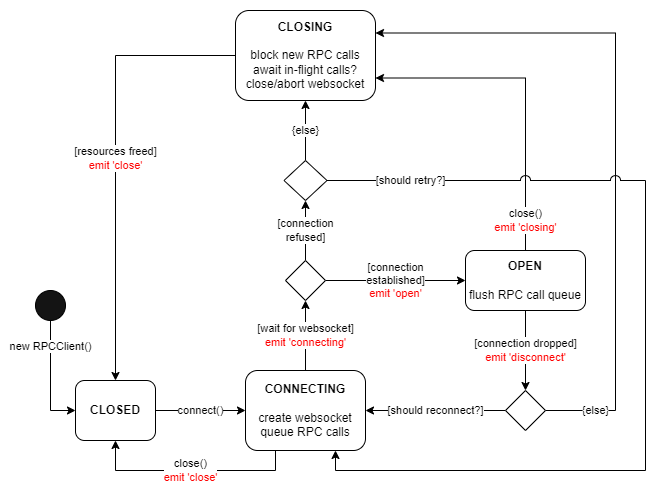

# RPCClient State Lifecycle

The following connection states relate to the [standard WebSocket ready states](https://developer.mozilla.org/en-US/docs/Web/API/WebSocket/readyState):

**CONNECTING**
* RPC calls & responses while in this state will be queued.

**OPEN**
* Previously queued messages are sent to the server upon entering this state.
* RPC calls & responses now flow freely.

**CLOSING**
* RPC calls while in this state are rejected.
* RPC responses will be silently dropped.

**CLOSED**
* RPC calls while in this state are rejected.
* RPC responses will be silently dropped.
